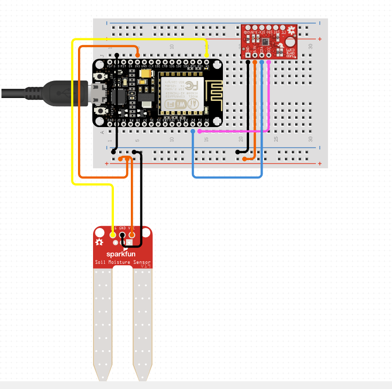
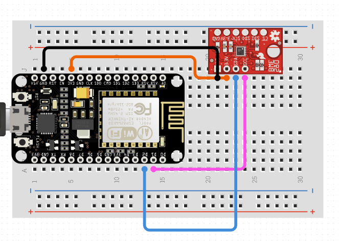

# Overview
My personal [Home Assistant Container](https://home-assistant.io) configurations

# <a name="menu">Menu</a>
 | [Hubs](#hubs) | [Lighting](#lighting) | [Climate](#climate)*| [Outlets & Switches](#outlets)|  [Locks](#locks)* | [Security](#security) | [Voice Assistant](#voice)* | [Media](#media) | [Sensors](#sensors) | [Cameras](#cameras)* | [Garage](#garage)* | [Vacuum](#vacuum)* | [Blinds](#blinds)* | [Appliances](#appliances)* | [Network](#network) | [Other Hardware](#other)*| [Software](#software)* | [Retired Devices](#retired)  |
 Not everything is implemented yet

## <a name="hubs">Hubs</a>

| [Go to Menu](#menu) |

| Device  | Quantity | Connection | Home Assistant | Notes |
| ------------- | :---: | ------------- | ------------- | ------------- |
| |  |  |  |  |

## <a name="lighting">Lighting</a>

| [Go to Menu](#menu) | 

| Device  | Quantity | Connection | Home Assistant | Notes |
| ------------- | :---: | ------------- | ------------- | ------------- |
| [Globe Electrics A19 LED Light Smart Bulb 10 W RGB](https://www.canac.ca/fr/ampoule-intelligente-del-a19-10-w-paquet-de-2-4201085) | 5 | Wifi | [Tuya](https://www.home-assistant.io/integrations/tuya/) | Color changing smart bulbs|
| [Globe Electrics A19 LED Light Smart Bulb 10 W](https://www.canac.ca/fr/ampoule-intelligente-del-a19-10-w-4141360) | 1 | Wifi | [Tuya](https://www.home-assistant.io/integrations/tuya/) | Color changing smart bulbs|
| [Globe Electrics Smart LED Tape Light 6.5 ft.](https://www.canac.ca/fr/ruban-lumineux-intelligent-del-6-5-pi-4201069) | 2 | Wifi | [Tuya](https://www.home-assistant.io/integrations/tuya/) | Color changing smart bulbs|

Lights are grouped via [light.yaml](https://github.com/petebdeblois/Home-AssistantConfig/blob/master/lib/light.yaml)

## <a name="outlets">Outlets & Switches</a>

| [Go to Menu](#menu) | 

| Device  | Quantity | Connection | Home Assistant | Notes |
| ------------- | :---: | ------------- | ------------- | ------------- |
| [Globe Electrics Wifi Switch](https://www.canac.ca/fr/prise-intelligente-wifi-4201063) | 2 | Wi-Fi | [Tuya](https://www.home-assistant.io/integrations/tuya/)  |  |
| [Avatar Controls Smart Plug WiFi Outlets Oval Socket Energy Monitoring](https://www.newegg.ca/p/35B-0048-00022?Item=9SIAPAHBGB5816) | 4 | Wi-Fi | [Tuya](https://www.home-assistant.io/integrations/tuya/) /  |To get Consumption, I am using [Tuya v2](https://github.com/tuya/tuya-home-assistantwhich) is still in beta |

## <a name="media">Media</a>

| [Go to Menu](#menu) |  

| Device  | Quantity | Connection | Home Assistant | Notes |
| ------------- | :---: | ------------- | ------------- | ------------- |
| [Plex Media Server](https://plex.tv) | 1 | Ethernet | [Plex](https://www.home-assistant.io/components/media_player.plex) / [Plex Activity Monitor](https://www.home-assistant.io/components/sensor.plex/) |  Media Server|  
## <a name="sensors">Sensors</a>

| [Go to Menu](#menu) |  

| Name  | Quantity | Connection | Home Assistant | Notes |
| ------------- | :---: | ------------- | ------------- | ------------- |
|  |  |  ||  |  

## <a name="media">Arduino Related</a>

| [Go to Menu](#menu) |  

| Device  | Quantity | Connection | Home Assistant | Notes |
| ------------- | :---: | ------------- | ------------- | ------------- |
| [Wemos D1 Mini Pro](https://www.electromike.com/wemos-d1-mini-arduino-wemos-d1.html) | 4 | Wifi | [ESPHome](https://esphome.io/guides/getting_started_hassio.html) |  ESP8266 | 
| [Temperature Sensor](https://www.electromike.com/bme280-capteur-numerique-temperature-humidite-pression-barometrique-arduino-mod-bme280.html) | 4 | Wifi | [ESPHome](https://esphome.io/guides/getting_started_hassio.html) |  BME280 |
| [Soil Humidity Sensor](https://www.electromike.com/capteur-d-humidite-pour-le-sol-compatible-arduino-arduino-sens-soil.html) | 2 | Wifi | [ESPHome](https://esphome.io/guides/getting_started_hassio.html) |  BME280 | 
| [Temp DS18B20](https://www.electromike.com/capteur-de-temperature-impermeable-10k-3950-arduino-tempsens-wp.html) | 1 | Wifi | [ESPHome](https://esphome.io/guides/getting_started_hassio.html) |  DS18B20 for aquarium| 

### Wiring

## <a name="voice">Voice Assistant</a>

| [Go to Menu](#menu) |

| Device  | Quantity | Connection | Home Assistant | Notes |
| ------------- | :---: | ------------- | ------------- | ------------- |
| [GoogleHome Mini]() | 4 | Wi-Fi | [Home Assistant Cloud](https://www.home-assistant.io/cloud/) | Audio only Voice Assistant |

